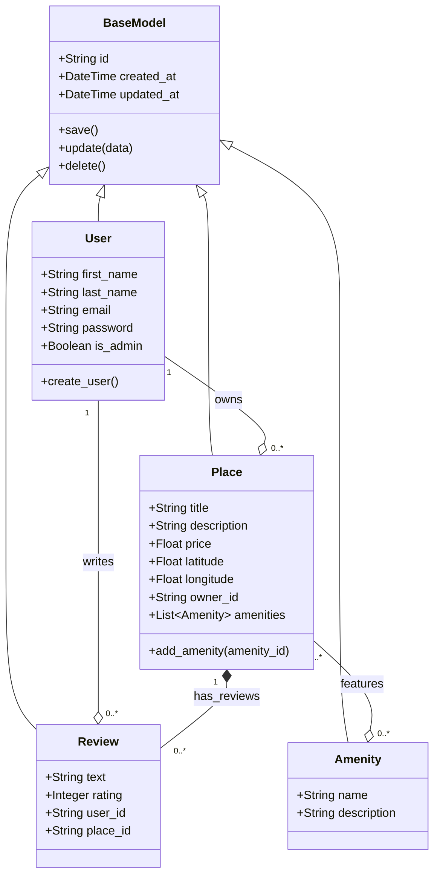

```mermaid
classDiagram
    class BaseModel {
        +String id
        +DateTime created_at
        +DateTime updated_at
        +save()
        +update(data)
        +delete()
    }

    class User {
        +String first_name
        +String last_name
        +String email
        +String password
        +Boolean is_admin
        +create_user()
    }

    class Place {
        +String title
        +String description
        +Float price
        +Float latitude
        +Float longitude
        +String owner_id
        +List~Amenity~ amenities
        +add_amenity(amenity_id)
    }

    class Review {
        +String text
        +Integer rating
        +String user_id
        +String place_id
    }

    class Amenity {
        +String name
        +String description
    }

    BaseModel <|-- User
    BaseModel <|-- Place
    BaseModel <|-- Review
    BaseModel <|-- Amenity

    User "1" --o "0..*" Place : owns
    User "1" --o "0..*" Review : writes
    Place "1" *-- "0..*" Review : has_reviews
    Place "0..*" --o "0..*" Amenity : features
```
