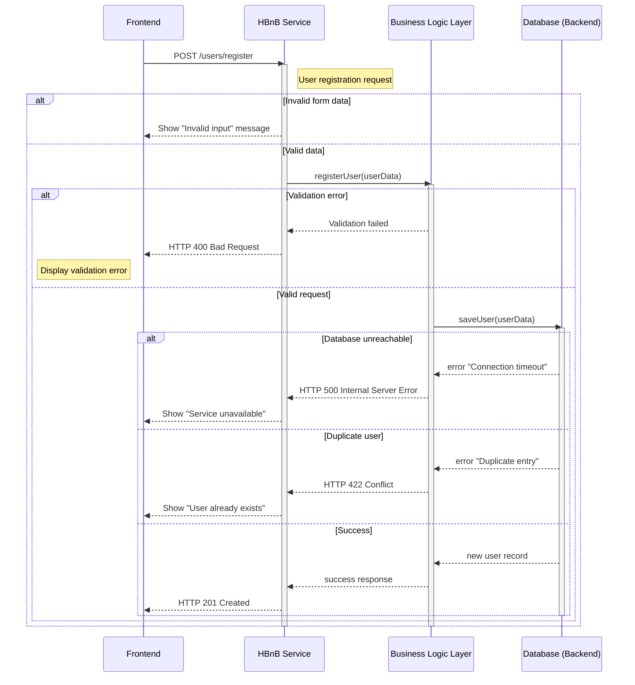
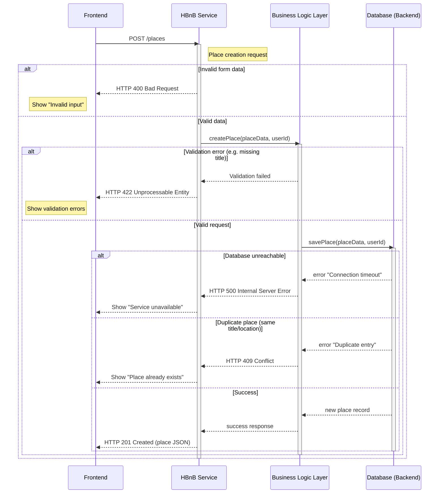
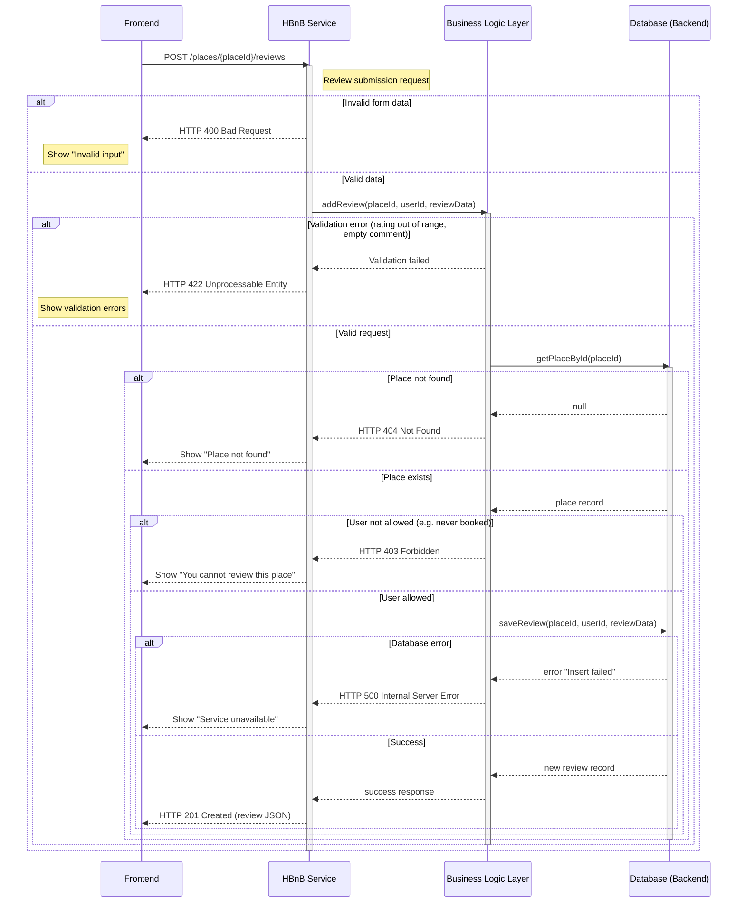
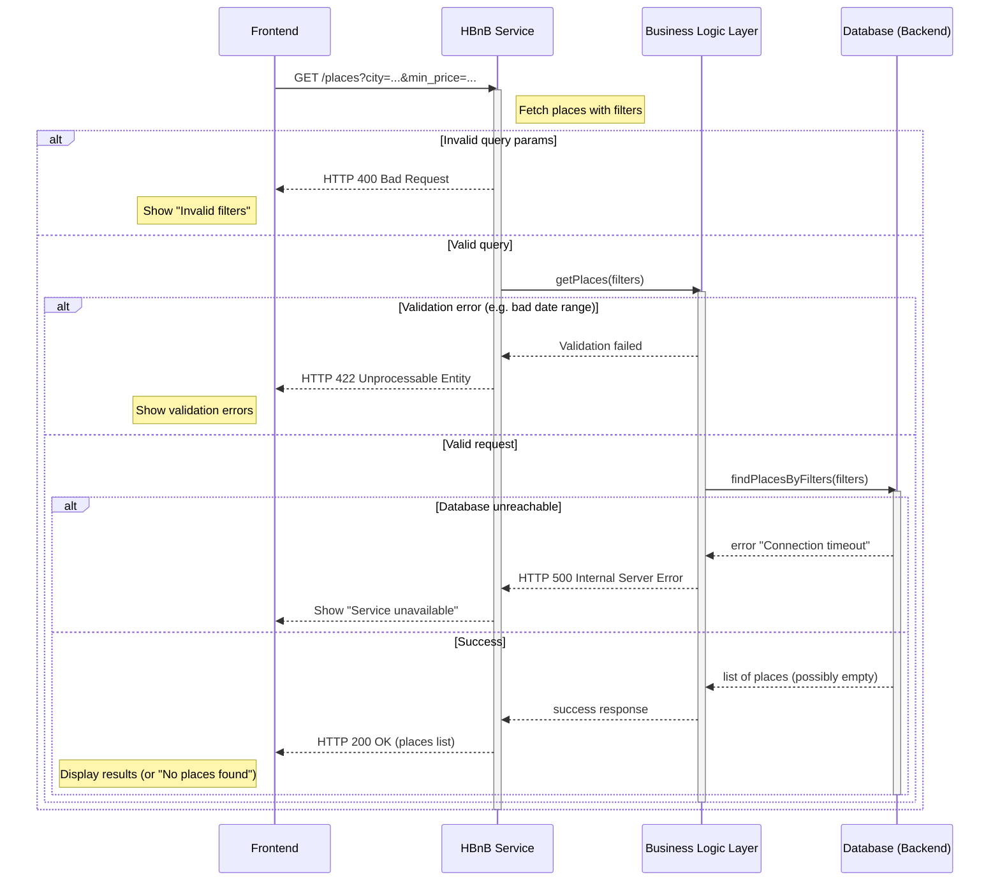

```mermaid
sequenceDiagram
    participant User as Frontend
    participant Service as HBnB Service
    participant Logic as Business Logic Layer
    participant Storage as Database (Backend)

    User->>Service: POST /users/register
    activate Service
    Note right of Service: User registration request

    alt Invalid form data
        Service-->>User: Show "Invalid input" message
    else Valid data
        Service->>Logic: registerUser(userData)
        activate Logic

        alt Validation error
            Logic-->>Service: Validation failed
            Service-->>User: HTTP 400 Bad Request
            Note left of User: Display validation error
        else Valid request
            Logic->>Storage: saveUser(userData)
            activate Storage

            alt Database unreachable
                Storage-->>Logic: error "Connection timeout"
                Logic-->>Service: HTTP 500 Internal Server Error
                Service-->>User: Show "Service unavailable"
            else Duplicate user
                Storage-->>Logic: error "Duplicate entry"
                Logic-->>Service: HTTP 422 Conflict
                Service-->>User: Show "User already exists"
            else Success
                Storage-->>Logic: new user record
                Logic-->>Service: success response
                Service-->>User: HTTP 201 Created
            end
            deactivate Storage
        end
    end

    deactivate Logic
    deactivate Service
```

```mermaid
sequenceDiagram
    participant User as Frontend
    participant Service as HBnB Service
    participant Logic as Business Logic Layer
    participant Storage as Database (Backend)

    User->>Service: POST /places
    activate Service
    Note right of Service: Place creation request

    alt Invalid form data
        Service-->>User: HTTP 400 Bad Request
        Note left of User: Show "Invalid input"
    else Valid data
        Service->>Logic: createPlace(placeData, userId)
        activate Logic

        alt Validation error (e.g. missing title)
            Logic-->>Service: Validation failed
            Service-->>User: HTTP 422 Unprocessable Entity
            Note left of User: Show validation errors
        else Valid request
            Logic->>Storage: savePlace(placeData, userId)
            activate Storage

            alt Database unreachable
                Storage-->>Logic: error "Connection timeout"
                Logic-->>Service: HTTP 500 Internal Server Error
                Service-->>User: Show "Service unavailable"
            else Duplicate place (same title/location)
                Storage-->>Logic: error "Duplicate entry"
                Logic-->>Service: HTTP 409 Conflict
                Service-->>User: Show "Place already exists"
            else Success
                Storage-->>Logic: new place record
                Logic-->>Service: success response
                Service-->>User: HTTP 201 Created (place JSON)
            end

            deactivate Storage
        end
        deactivate Logic
    end

    deactivate Service
```

```mermaid
sequenceDiagram
    participant User as Frontend
    participant Service as HBnB Service
    participant Logic as Business Logic Layer
    participant Storage as Database (Backend)

    User->>Service: POST /places/{placeId}/reviews
    activate Service
    Note right of Service: Review submission request

    alt Invalid form data
        Service-->>User: HTTP 400 Bad Request
        Note left of User: Show "Invalid input"
    else Valid data
        Service->>Logic: addReview(placeId, userId, reviewData)
        activate Logic

        alt Validation error (rating out of range, empty comment)
            Logic-->>Service: Validation failed
            Service-->>User: HTTP 422 Unprocessable Entity
            Note left of User: Show validation errors
        else Valid request
            Logic->>Storage: getPlaceById(placeId)
            activate Storage

            alt Place not found
                Storage-->>Logic: null
                Logic-->>Service: HTTP 404 Not Found
                Service-->>User: Show "Place not found"
            else Place exists
                Storage-->>Logic: place record

                alt User not allowed (e.g. never booked)
                    Logic-->>Service: HTTP 403 Forbidden
                    Service-->>User: Show "You cannot review this place"
                else User allowed
                    Logic->>Storage: saveReview(placeId, userId, reviewData)
                    alt Database error
                        Storage-->>Logic: error "Insert failed"
                        Logic-->>Service: HTTP 500 Internal Server Error
                        Service-->>User: Show "Service unavailable"
                    else Success
                        Storage-->>Logic: new review record
                        Logic-->>Service: success response
                        Service-->>User: HTTP 201 Created (review JSON)
                    end
                end
            end

            deactivate Storage
        end

        deactivate Logic
    end

    deactivate Service
```

```mermaid
sequenceDiagram
    participant User as Frontend
    participant Service as HBnB Service
    participant Logic as Business Logic Layer
    participant Storage as Database (Backend)

    User->>Service: GET /places?city=...&min_price=...
    activate Service
    Note right of Service: Fetch places with filters

    alt Invalid query params
        Service-->>User: HTTP 400 Bad Request
        Note left of User: Show "Invalid filters"
    else Valid query
        Service->>Logic: getPlaces(filters)
        activate Logic

        alt Validation error (e.g. bad date range)
            Logic-->>Service: Validation failed
            Service-->>User: HTTP 422 Unprocessable Entity
            Note left of User: Show validation errors
        else Valid request
            Logic->>Storage: findPlacesByFilters(filters)
            activate Storage

            alt Database unreachable
                Storage-->>Logic: error "Connection timeout"
                Logic-->>Service: HTTP 500 Internal Server Error
                Service-->>User: Show "Service unavailable"
            else Success
                Storage-->>Logic: list of places (possibly empty)
                Logic-->>Service: success response
                Service-->>User: HTTP 200 OK (places list)
                Note left of User: Display results (or "No places found")
            end

            deactivate Storage
        end

        deactivate Logic
    end

    deactivate Service
```
