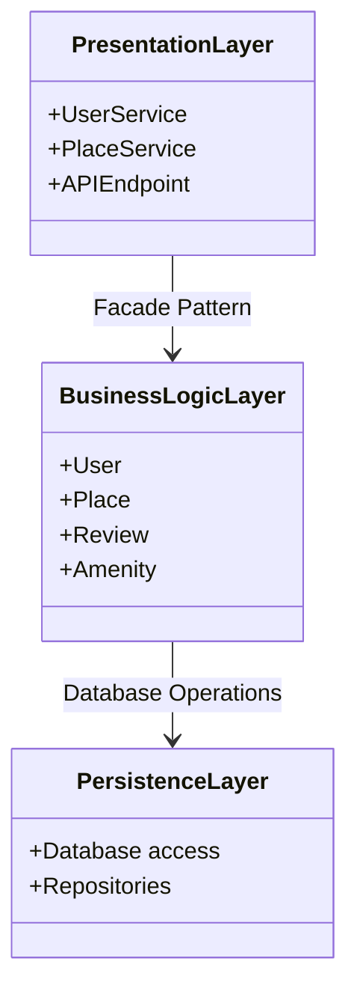
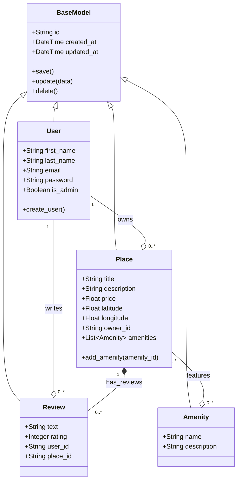
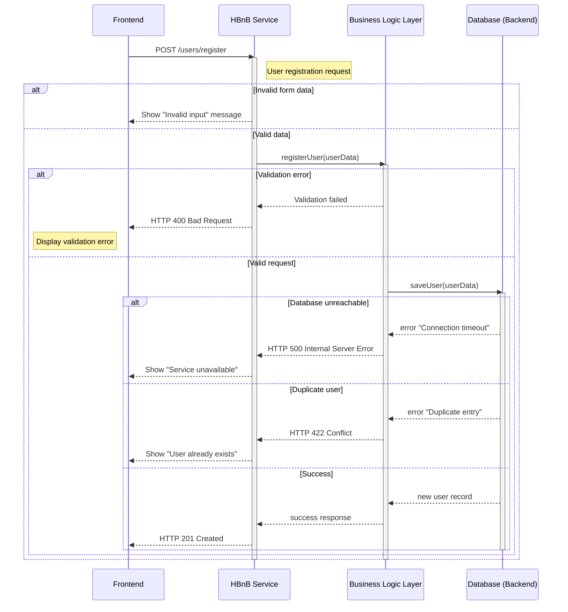
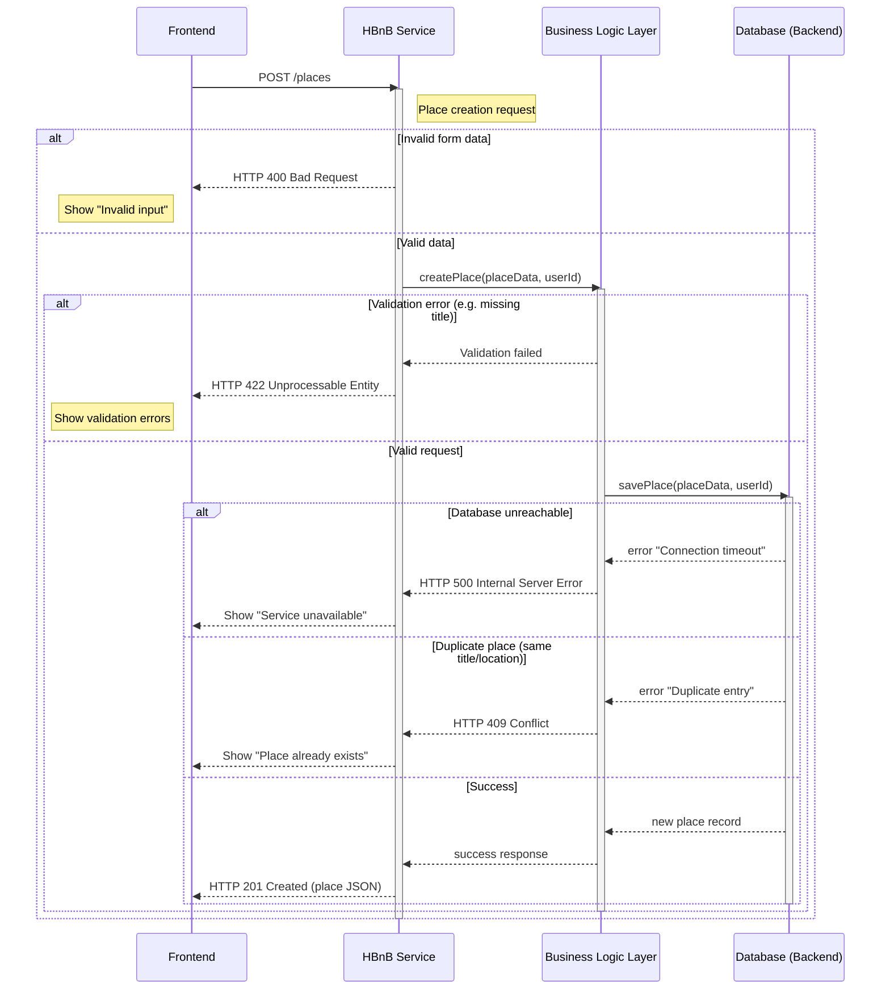
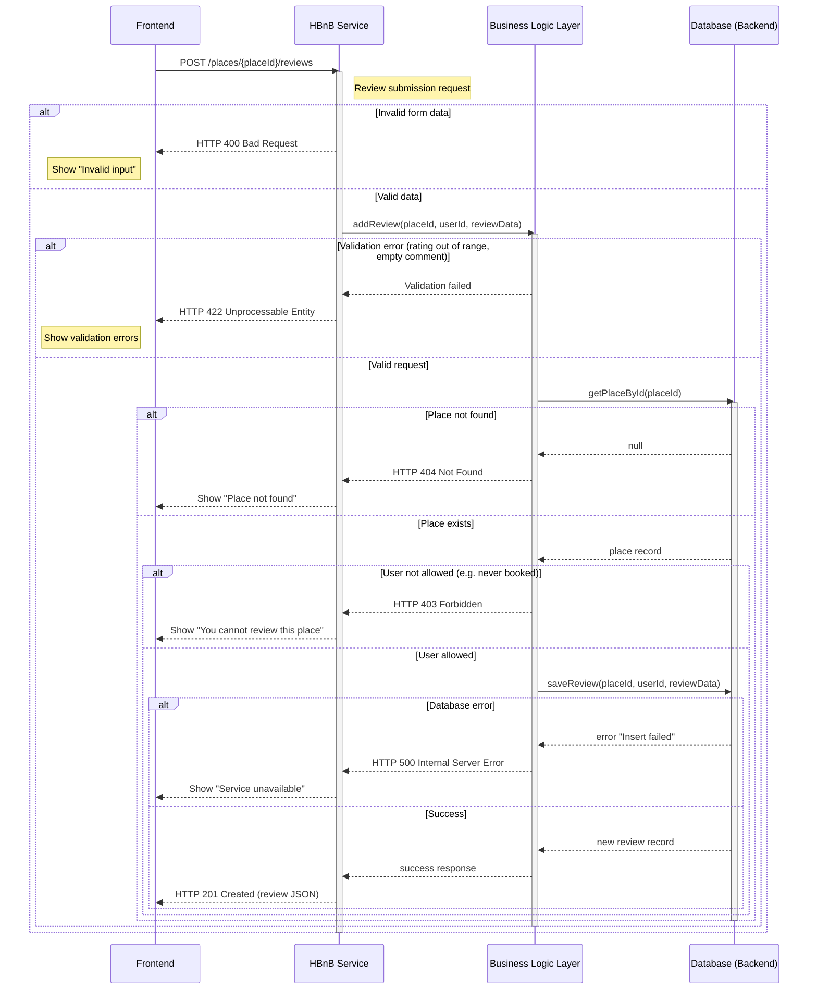
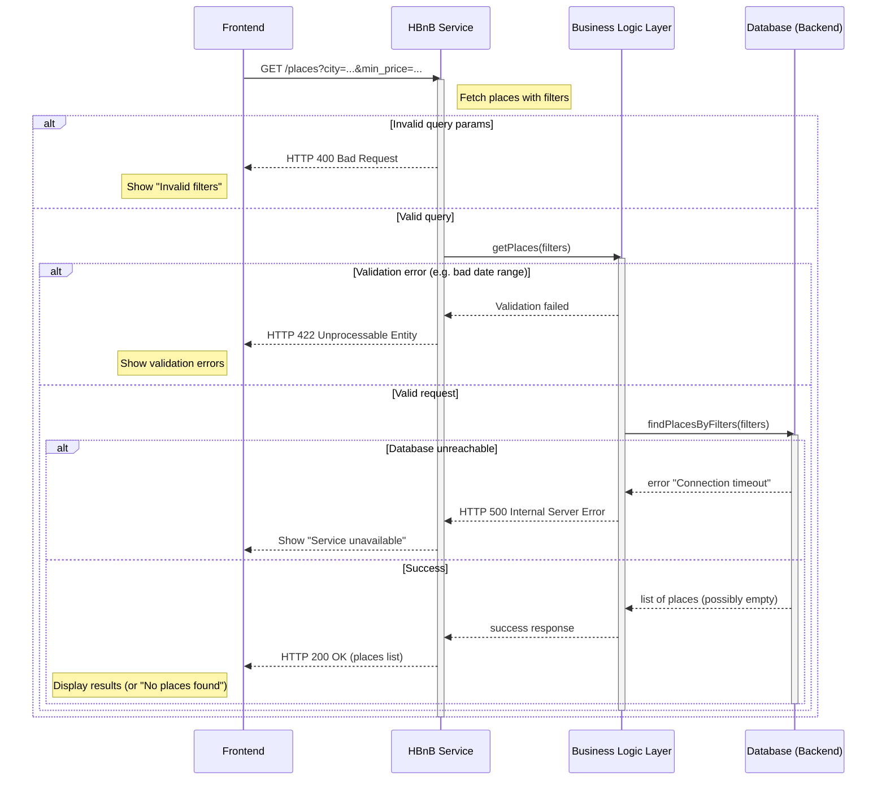

# HBnB Technical Documentation

## Table of Contents
1. [Introduction](#introduction)
2. [High-Level Architecture](#high-level-architecture)
3. [Business Logic Layer](#business-logic-layer)
4. [API Interaction Flow](#api-interaction-flow)

---

## Introduction

### Purpose
This technical document serves as a comprehensive reference guide for the HBnB (Holberton Bed and Breakfast) application development. It provides a detailed overview of the system architecture, business logic components, and API interaction flows that will guide the implementation process.

### Project Overview
HBnB is a web-based platform that enables users to list, discover, and book accommodations. The application follows a modern three-tier architecture pattern, implementing industry best practices for maintainability, scalability, and separation of concerns.

### Document Scope
This document contains:
- **High-Level Architecture**: System layering and communication patterns
- **Business Logic Layer**: Detailed class structures and relationships
- **API Interaction Flow**: Step-by-step sequence diagrams for core operations

### Audience
This document is intended for:
- Software developers implementing the application
- System architects reviewing the design
- QA engineers developing test strategies
- Technical stakeholders requiring system understanding

---

## High-Level Architecture

### Overview
The HBnB application follows a **three-tier layered architecture** that separates concerns and promotes modularity. This design enables independent development, testing, and scaling of each layer.

### Package Diagram



### Layer Descriptions

#### Presentation Layer
| Component | Responsibility |
|-----------|---------------|
| **APIEndpoint** | Handles HTTP requests/responses, routing, and serialization |
| **UserService** | Manages user-related API operations (registration, authentication, profile) |
| **PlaceService** | Handles place listing, search, and booking operations |

**Design Rationale**: The Presentation Layer acts as the entry point for all client interactions. It validates incoming requests, delegates business operations to the Business Logic Layer, and formats responses for clients.

#### Business Logic Layer
| Component | Responsibility |
|-----------|---------------|
| **User** | Encapsulates user data and behavior (validation, authentication logic) |
| **Place** | Manages place properties, pricing, and availability |
| **Review** | Handles review creation, validation, and aggregation |
| **Amenity** | Represents features and facilities of places |

**Design Rationale**: This layer contains all domain logic, ensuring that business rules are centralized and reusable regardless of how they are accessed (API, CLI, etc.).

#### Persistence Layer
| Component | Responsibility |
|-----------|---------------|
| **Repositories** | Abstract data access patterns (CRUD operations) |
| **Database Access** | Manages connections, queries, and transactions |

**Design Rationale**: The Persistence Layer isolates database operations, enabling easy switching between storage solutions (in-memory, SQL, NoSQL) without affecting business logic.

### Communication Patterns

#### Facade Pattern
The **Facade Pattern** is used between the Presentation and Business Logic layers:
- Provides a simplified interface to complex subsystems
- Reduces coupling between layers
- Centralizes cross-cutting concerns (logging, validation, error handling)

#### Data Flow
```
Client Request → Presentation Layer → Facade → Business Logic → Persistence → Database
                                                                              ↓
Client Response ← Presentation Layer ← Facade ← Business Logic ← Persistence ←
```

---

## Business Logic Layer

### Overview
The Business Logic Layer contains the core domain entities of the HBnB application. All entities inherit from a common `BaseModel` class that provides shared functionality for identification, timestamps, and persistence operations.

### Class Diagram



### Entity Descriptions

#### BaseModel (Abstract Parent Class)
| Attribute | Type | Description |
|-----------|------|-------------|
| `id` | String (UUID) | Unique identifier for each entity |
| `created_at` | DateTime | Timestamp of entity creation |
| `updated_at` | DateTime | Timestamp of last modification |

| Method | Description |
|--------|-------------|
| `save()` | Persist the entity to storage |
| `update(data)` | Modify entity attributes and update timestamp |
| `delete()` | Remove entity from storage |

**Design Rationale**: Centralizing common attributes and methods in `BaseModel` ensures consistency across all entities and reduces code duplication.

#### User
| Attribute | Type | Constraints |
|-----------|------|-------------|
| `first_name` | String | Required, max 50 characters |
| `last_name` | String | Required, max 50 characters |
| `email` | String | Required, unique, valid email format |
| `password` | String | Required, hashed, min 8 characters |
| `is_admin` | Boolean | Default: false |

**Business Rules**:
- Email must be unique across all users
- Password must be securely hashed before storage
- Admin users have elevated privileges for moderation

#### Place
| Attribute | Type | Constraints |
|-----------|------|-------------|
| `title` | String | Required, max 100 characters |
| `description` | String | Optional, max 2000 characters |
| `price` | Float | Required, positive value |
| `latitude` | Float | Required, range: -90 to 90 |
| `longitude` | Float | Required, range: -180 to 180 |
| `owner_id` | String | Required, references User.id |
| `amenities` | List | Collection of associated amenities |

**Business Rules**:
- A place must have an owner (User)
- Price must be a positive number
- Geographic coordinates must be valid

#### Review
| Attribute | Type | Constraints |
|-----------|------|-------------|
| `text` | String | Required, max 1000 characters |
| `rating` | Integer | Required, range: 1 to 5 |
| `user_id` | String | Required, references User.id |
| `place_id` | String | Required, references Place.id |

**Business Rules**:
- A user cannot review their own place
- Rating must be between 1 and 5
- One review per user per place

#### Amenity
| Attribute | Type | Constraints |
|-----------|------|-------------|
| `name` | String | Required, unique, max 50 characters |
| `description` | String | Optional, max 255 characters |

**Business Rules**:
- Amenity names must be unique
- Examples: WiFi, Parking, Pool, Kitchen

### Entity Relationships

| Relationship | Type | Description |
|-------------|------|-------------|
| User → Place | One-to-Many (Aggregation) | A user can own multiple places; places can exist independently |
| User → Review | One-to-Many (Aggregation) | A user can write multiple reviews |
| Place → Review | One-to-Many (Composition) | Reviews are dependent on place existence |
| Place ↔ Amenity | Many-to-Many (Aggregation) | Places can have multiple amenities; amenities can belong to multiple places |

---

## API Interaction Flow

### Overview
This section presents sequence diagrams illustrating the flow of API calls through the system layers. Each diagram shows the interactions between the Frontend, Service Layer, Business Logic, and Database, including error handling scenarios.

---

### 4.1 User Registration

**Endpoint**: `POST /users/register`

**Purpose**: Create a new user account in the system.



**Key Components**:
- **Frontend**: Collects user registration data (name, email, password)
- **Service Layer**: Validates input format and orchestrates the registration process
- **Business Logic**: Applies business rules (email uniqueness, password requirements)
- **Database**: Persists the new user record

**HTTP Response Codes**:
| Code | Meaning |
|------|---------|
| 201 | User successfully created |
| 400 | Invalid input data format |
| 422 | Business rule violation (duplicate email) |
| 500 | Server/database error |

---

### 4.2 Place Creation

**Endpoint**: `POST /places`

**Purpose**: Allow authenticated users to create new place listings.



**Key Components**:
- **Frontend**: Collects place details (title, description, price, location, amenities)
- **Service Layer**: Authenticates user and validates input
- **Business Logic**: Validates place data and associates with owner
- **Database**: Stores place record with relationships

**HTTP Response Codes**:
| Code | Meaning |
|------|---------|
| 201 | Place successfully created |
| 400 | Invalid input data format |
| 409 | Duplicate place detected |
| 422 | Business rule violation |
| 500 | Server/database error |

---

### 4.3 Review Submission

**Endpoint**: `POST /places/{placeId}/reviews`

**Purpose**: Allow users to submit reviews for places they have visited.



**Key Components**:
- **Frontend**: Collects review text and rating
- **Service Layer**: Validates input and authenticates user
- **Business Logic**: Verifies place exists and user eligibility
- **Database**: Stores review with associations

**HTTP Response Codes**:
| Code | Meaning |
|------|---------|
| 201 | Review successfully created |
| 400 | Invalid input data format |
| 403 | User not authorized to review |
| 404 | Place not found |
| 422 | Business rule violation |
| 500 | Server/database error |

---

### 4.4 Fetching Places (with Filters)

**Endpoint**: `GET /places?city=...&min_price=...`

**Purpose**: Retrieve a list of places based on search criteria.



**Key Components**:
- **Frontend**: Provides search filters (location, price range, amenities)
- **Service Layer**: Parses and validates query parameters
- **Business Logic**: Applies filter logic and business rules
- **Database**: Executes optimized queries with filters

**HTTP Response Codes**:
| Code | Meaning |
|------|---------|
| 200 | Success (may return empty array) |
| 400 | Invalid query parameters |
| 422 | Business rule violation |
| 500 | Server/database error |

---

## Summary

This technical document provides a comprehensive blueprint for the HBnB application implementation. The key architectural decisions include:

1. **Three-Tier Architecture**: Clear separation between presentation, business logic, and persistence layers
2. **Facade Pattern**: Simplified interface between layers, reducing coupling
3. **Inheritance Model**: All entities inherit from `BaseModel` for consistency
4. **RESTful API Design**: Standard HTTP methods and status codes for predictable behavior
5. **Comprehensive Error Handling**: Multiple error scenarios handled at each layer

### Implementation Priorities

| Priority | Component | Rationale |
|----------|-----------|-----------|
| 1 | BaseModel & Entities | Foundation for all business logic |
| 2 | Persistence Layer | Enable data storage early |
| 3 | Business Logic Validation | Ensure data integrity |
| 4 | API Endpoints | Expose functionality to clients |
| 5 | Error Handling | Production readiness |

---

*Document Version: 1.0*  
*Last Updated: February 2026*  
*Project: HBnB - Holberton Bed and Breakfast*
