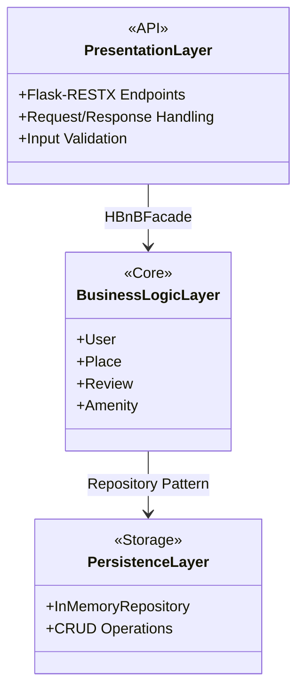
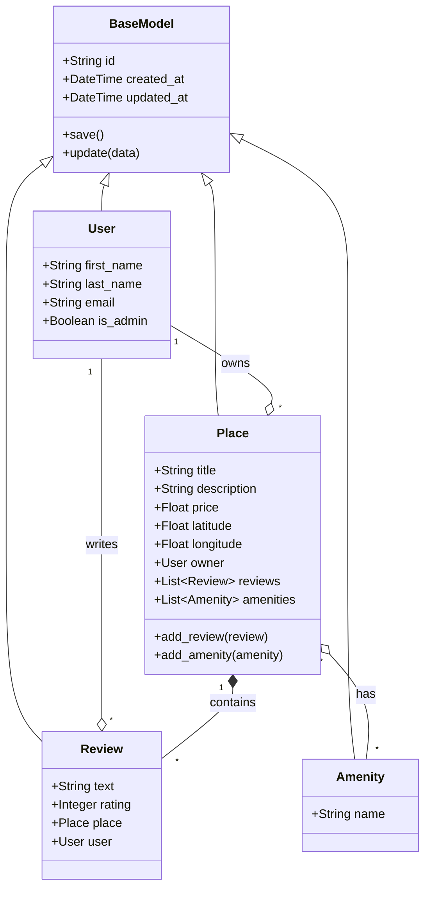
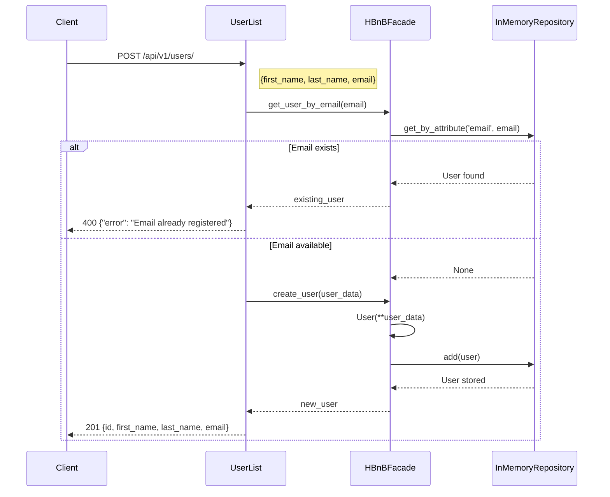
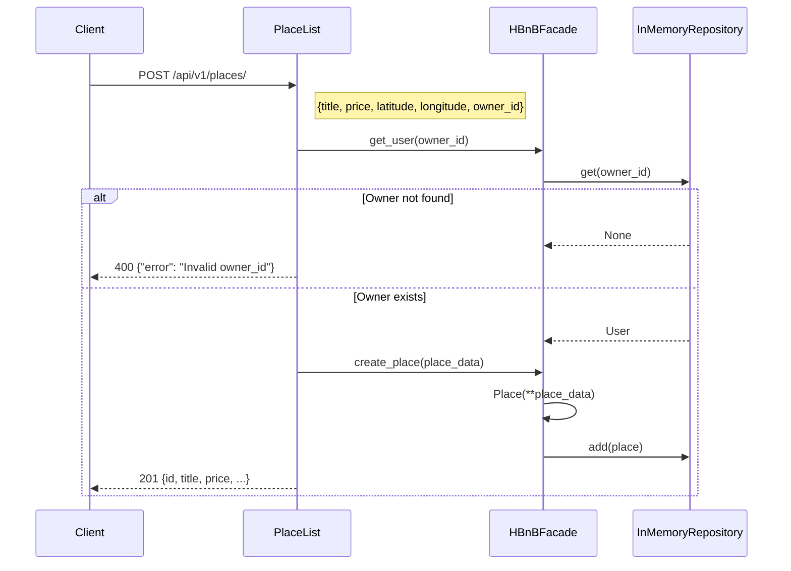
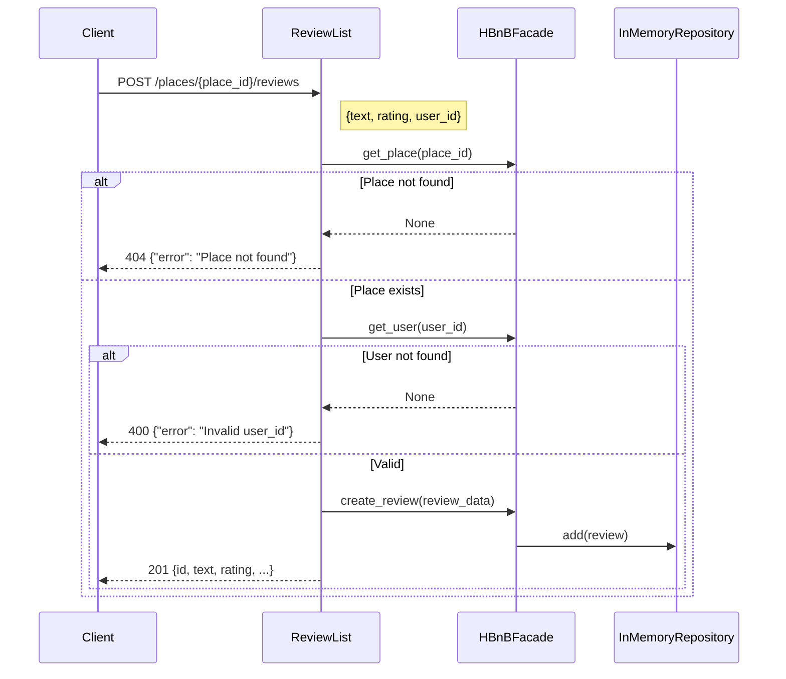
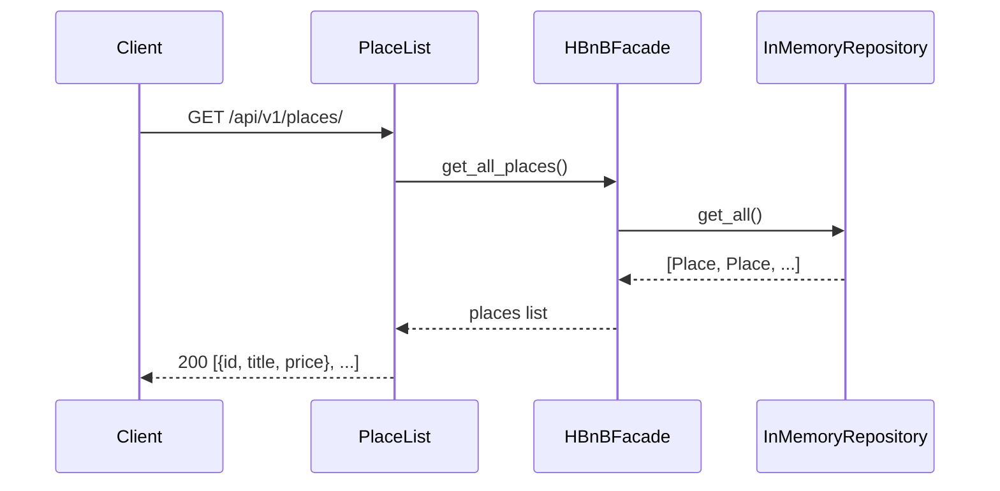

# HBnB Technical Documentation

## Table of Contents

1. [Introduction](#1-introduction)
2. [High-Level Architecture](#2-high-level-architecture)
3. [Business Logic Layer](#3-business-logic-layer)
4. [API Interaction Flow](#4-api-interaction-flow)

---

## 1. Introduction

### 1.1 Purpose

This document provides a technical blueprint for the HBnB (Holberton Bed and Breakfast) application. It guides developers through the architecture, data models, and API design.

### 1.2 Project Overview

HBnB is a web platform for listing and discovering accommodations. Users can:
- Register and manage profiles
- Create place listings
- Write reviews for places
- Associate amenities with places

### 1.3 Document Scope

| Section | Content |
|---------|---------|
| High-Level Architecture | Three-tier layered design with Facade pattern |
| Business Logic Layer | Entity classes, attributes, and relationships |
| API Interaction Flow | Sequence diagrams for API operations |

---

## 2. High-Level Architecture

### 2.1 Overview

The application uses a **three-tier layered architecture** with the **Facade Pattern** for inter-layer communication.

### 2.2 Package Diagram



### 2.3 Layer Descriptions

#### Presentation Layer (API)

Handles HTTP requests via Flask-RESTX.

| Component | Responsibility |
|-----------|----------------|
| `api/v1/users.py` | User endpoints (POST, GET, PUT) |
| `api/v1/places.py` | Place endpoints |
| `api/v1/reviews.py` | Review endpoints |
| `api/v1/amenities.py` | Amenity endpoints |

#### Business Logic Layer (Models)

Contains domain entities with validation logic.

| Model | Description |
|-------|-------------|
| `BaseModel` | Common attributes (id, created_at, updated_at) |
| `User` | User registration and profile |
| `Place` | Accommodation listings |
| `Review` | User feedback for places |
| `Amenity` | Place features (WiFi, Pool, etc.) |

#### Persistence Layer

Manages data storage via repository pattern.

| Component | Description |
|-----------|-------------|
| `InMemoryRepository` | In-memory storage with CRUD operations |
| `HBnBFacade` | Service layer coordinating repositories |

### 2.4 Facade Pattern

The `HBnBFacade` class provides a unified interface:

```python
class HBnBFacade:
    def __init__(self):
        self.user_repo = InMemoryRepository()
        self.place_repo = InMemoryRepository()
        self.review_repo = InMemoryRepository()
        self.amenity_repo = InMemoryRepository()
```

**Benefits**:
- Simplifies API layer code
- Centralizes business operations
- Decouples layers for easier testing

---

## 3. Business Logic Layer

### 3.1 Class Diagram



### 3.2 Entity Specifications

#### BaseModel

Base class with common attributes.

| Attribute | Type | Description |
|-----------|------|-------------|
| `id` | String (UUID4) | Unique identifier |
| `created_at` | DateTime | Creation timestamp |
| `updated_at` | DateTime | Last update timestamp |

| Method | Description |
|--------|-------------|
| `save()` | Updates `updated_at` timestamp |
| `update(data)` | Updates attributes from dictionary |

#### User

| Attribute | Type | Constraints |
|-----------|------|-------------|
| `first_name` | String | Required, max 50 chars |
| `last_name` | String | Required, max 50 chars |
| `email` | String | Required, valid format, unique |
| `is_admin` | Boolean | Default: False |

**Validation**: Email format validated with regex, names must be non-empty strings.

#### Place

| Attribute | Type | Constraints |
|-----------|------|-------------|
| `title` | String | Required, max 100 chars |
| `description` | String | Optional |
| `price` | Float | Required, must be positive |
| `latitude` | Float | Required, -90.0 to 90.0 |
| `longitude` | Float | Required, -180.0 to 180.0 |
| `owner` | User | Required, User instance |
| `reviews` | List | List of Review objects |
| `amenities` | List | List of Amenity objects |

#### Review

| Attribute | Type | Constraints |
|-----------|------|-------------|
| `text` | String | Required |
| `rating` | Integer | Required, 1 to 5 |
| `place` | Place | Required, Place instance |
| `user` | User | Required, User instance |

#### Amenity

| Attribute | Type | Constraints |
|-----------|------|-------------|
| `name` | String | Required, max 50 chars |

### 3.3 Relationships

| Relationship | Type | Description |
|--------------|------|-------------|
| User → Place | One-to-Many | User owns multiple places |
| User → Review | One-to-Many | User writes multiple reviews |
| Place → Review | Composition | Reviews belong to place |
| Place ↔ Amenity | Many-to-Many | Places have multiple amenities |

---

## 4. API Interaction Flow

### 4.1 User Registration

**Endpoint**: `POST /api/v1/users/`



**Response Codes**:
| Code | Condition |
|------|-----------|
| 201 | User created |
| 400 | Email exists or invalid data |

### 4.2 Place Creation

**Endpoint**: `POST /api/v1/places/`



**Response Codes**:
| Code | Condition |
|------|-----------|
| 201 | Place created |
| 400 | Invalid data or owner not found |

### 4.3 Review Submission

**Endpoint**: `POST /api/v1/places/<place_id>/reviews`



**Response Codes**:
| Code | Condition |
|------|-----------|
| 201 | Review created |
| 400 | Invalid data |
| 404 | Place not found |

### 4.4 Fetch Places List

**Endpoint**: `GET /api/v1/places/`



**Response Codes**:
| Code | Condition |
|------|-----------|
| 200 | Success (may be empty list) |

---

## 5. HTTP Status Codes

| Code | Meaning |
|------|---------|
| 200 | Success |
| 201 | Created |
| 400 | Bad Request / Validation Error |
| 404 | Not Found |

---

*Version: 1.0 | HBnB Project | February 2026*
