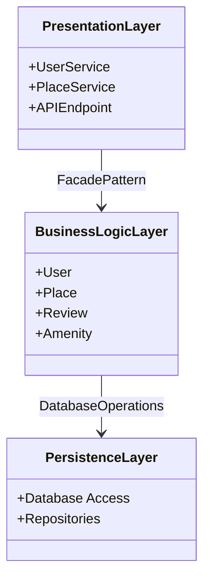
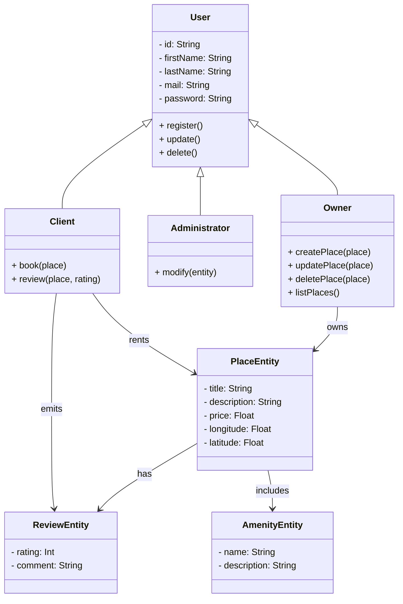
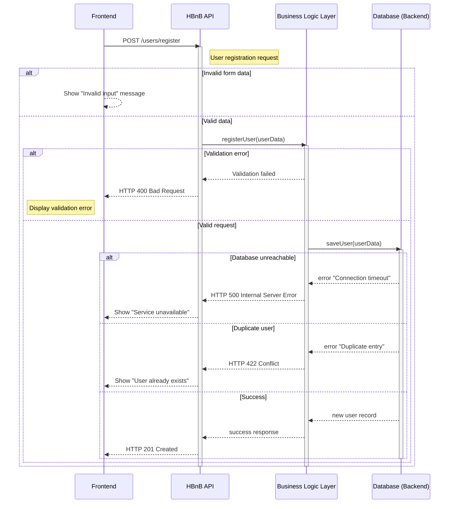
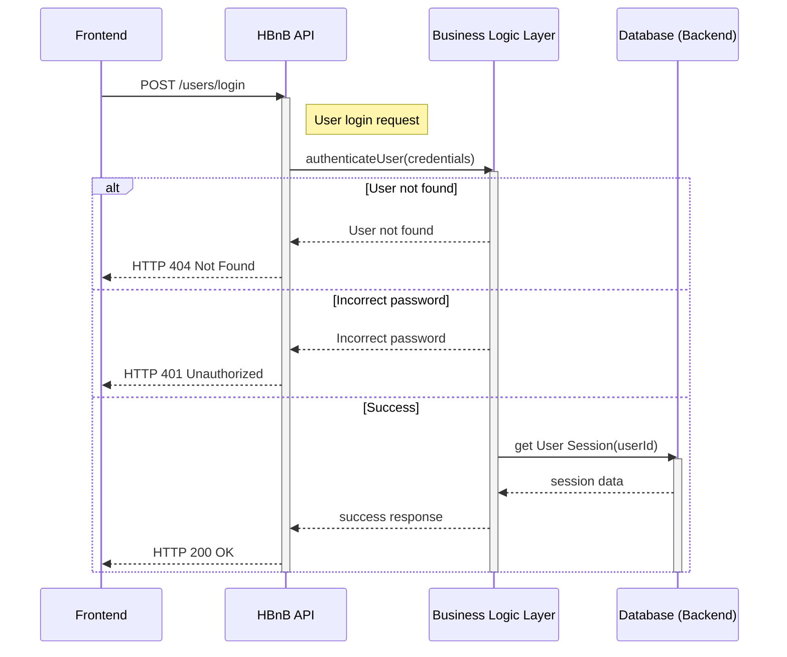
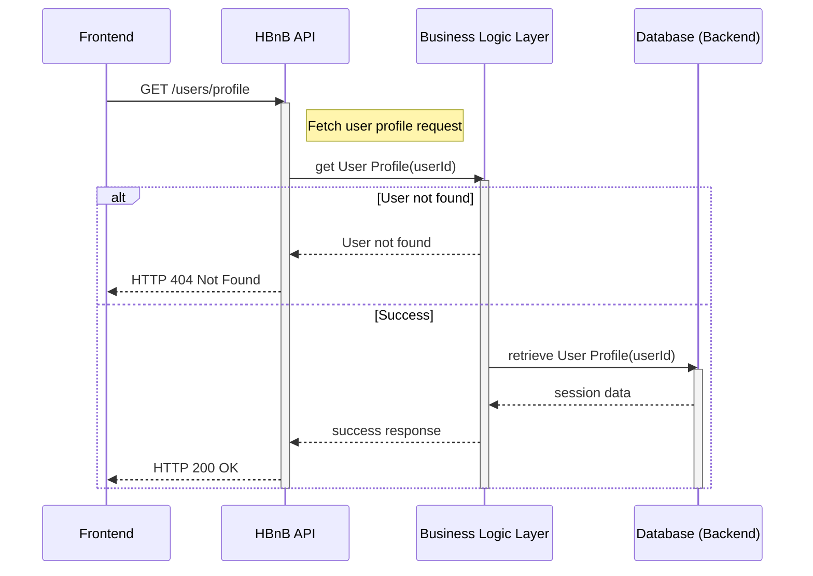
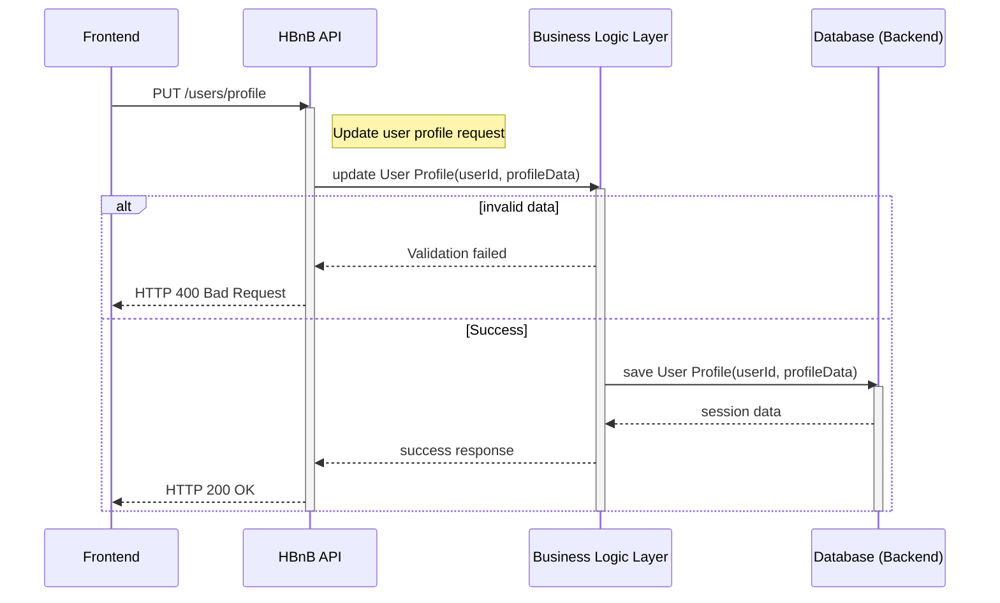

# task_0 High-Level Package Diagram
# note
1.Presentation Layer

Components:
UserService: Manages user-related operations such as registration, login, and profile management.
PlaceService: Handles operations related to places, including listing, creating, and updating place details.
APIEndpoint: The interface through which clients interact with the services, receiving requests and sending responses.

2.Responsibility: This layer is responsible for handling user interactions with the application, serving as the entry point for all client requests. It processes input from users and returns responses after interacting with the underlying business logic.
Business Logic Layer

Components:
User: Represents user entities and encapsulates user-related business logic.
Place: Represents place entities and contains logic related to place management.
Review: Handles the logic for user reviews associated with places.
Amenity: Represents amenities associated with places, managing their attributes and behaviors.
Responsibility: This layer contains the core logic of the application, processing data received from the presentation layer and applying business rules. It acts as an intermediary between the presentation and persistence layers, ensuring that business rules are enforced.
Persistence Layer

Components:
Database Access: Interfaces for performing CRUD (Create, Read, Update, Delete) operations on the database.
Repositories: Abstraction layers that encapsulate data access logic, providing methods for querying and manipulating data.
Responsibility: This layer is responsible for data storage and retrieval. It directly interacts with the database, ensuring that data is persisted and can be accessed efficiently.
Communication Pathways
Facade Pattern:
The communication between the Presentation Layer and the Business Logic Layer is facilitated by the Facade Pattern. This design pattern provides a simplified interface (the API) to the complex subsystems (business logic and persistence layers), allowing the presentation layer to interact with the business logic without needing to understand the details of the underlying implementations.
The APIEndpoint acts as a facade that exposes methods from the UserService and PlaceService, allowing clients to perform operations without directly interacting with the business logic or persistence layers.
Benefits of the Facade Pattern
Simplicity: The facade pattern simplifies the interface for clients, making it easier to use the application without needing to understand the complexities of the underlying layers.
Decoupling: It decouples the presentation layer from the business logic and persistence layers, promoting a cleaner architecture and making it easier to maintain and extend the application.
Flexibility: Changes in the business logic or persistence layers can be made with minimal impact on the presentation layer, as the facade provides a stable interface.

# code

# task_1 Detailed Class Diagram for Business Logic Layer

# note
Here’s the text formatted for a presentation in prompt mode, including explanatory notes and the code for the class diagram in a format suitable for a written document.

Class Diagram for the Business Logic Layer of the HBnB Application
Explanatory Notes
1. Key Entities
The class diagram represents the key entities within the business logic layer, namely User, PlaceEntity, ReviewEntity, and AmenityEntity.

User

Attributes:

id: Unique identifier of type String.
firstName: First name of the user.
lastName: Last name of the user.
mail: User's email address.
password: User's password.

Methods:

register(): Allows a user to register.
update(): Updates the user's information.
delete(): Deletes the user.

Role: Base class for different user types (Client, Administrator, Owner).

Client

Methods:

book(place): Books a place.
review(place, rating): Submits a review for a place.

Relation: Inherits from User. Has associations with PlaceEntity and ReviewEntity.

Administrator

Methods:

modify(entity): Modifies an entity (can be a place, a review, etc.).

Relation: Inherits from User.

Owner

Methods:

createPlace(place): Creates a new place.
updatePlace(place): Updates an existing place.
deletePlace(place): Deletes a place.
listPlaces(): Lists all owned places.

Relation: Inherits from User. Has an association with PlaceEntity.

2. Associated Entities

PlaceEntity

Attributes:

title: Title of the place.
description: Description of the place.
price: Rental price.
longitude: Longitude coordinate.
latitude: Latitude coordinate.

Relations:

Has an association with ReviewEntity (a place can have multiple reviews).
Has an association with AmenityEntity (a place can have multiple amenities).

ReviewEntity

Attributes:

rating: Rating given to the place (integer).
comment: Comment left by the client.

Relation: Is associated with PlaceEntity (a review is linked to a place).

AmenityEntity

Attributes:

name: Name of the amenity.
description: Description of the amenity.

Relation: Is associated with PlaceEntity (amenities are linked to a place).

3. Relationships and Multiplicity

Inheritance: The User class serves as the base class for Client, Administrator, and Owner, allowing them to share common attributes and methods.
Associations:

Client has relationships with PlaceEntity (for booking) and ReviewEntity (for submitting reviews).
Owner has a ownership relationship with PlaceEntity, indicating that an owner can manage multiple places.
PlaceEntity has relationships with ReviewEntity and AmenityEntity, indicating that a place can have multiple reviews and amenities.

Class Diagram Code

Conclusion
This class diagram provides a clear and detailed representation of the business logic of the HBnB application, illustrating the key entities and their interactions. It is essential to follow these recommendations to ensure that the diagram meets project requirements and accurately reflects the application's structure.

# task_2 Sequence Diagrams for API Calls

# note

API Calls to Model
User Registration: A user signs up for a new account.
Place Creation: A user creates a new place listing.
Review Submission: A user submits a review for a place.
Fetching a List of Places: A user requests a list of places based on certain criteria.
Steps to Complete the Task

1. Understand the Use Cases
Review Requirements: Examine the requirements and business logic for each selected API call.
Sequence of Operations: Understand the sequence of operations needed to fulfill each API call, from the moment a request is received by the API to the point where a response is returned to the client.

2. Identify Key Components Involved
Determine Components: Identify which components of the system (within each layer) are involved in handling each API call.
Order of Operations: Identify the order of operations, including method calls and data exchanges between components.

3. Design the Sequence Diagrams
Draft Interactions: Begin by drafting the sequence of interactions for each API call.
Sequence Diagram: For each diagram, start with the API call from the Presentation Layer, followed by interactions with the Business Logic Layer, and ending with operations in the Persistence Layer.
Flow of Messages: Clearly show the flow of messages, including method invocations, data retrieval, and processing steps.

4. Refine and Review
Review Your Diagrams: Ensure they accurately reflect the flow of information and operations required to fulfill each API call.
Clarity and Completeness: Refine the diagrams for clarity and completeness, ensuring all relevant interactions are captured.

# code 

# 1 - User Registration

# 2 - Place Creation

# 3 - Review Submission

# 4 - Fetching a List of Places

