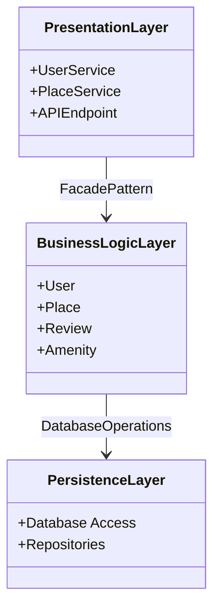
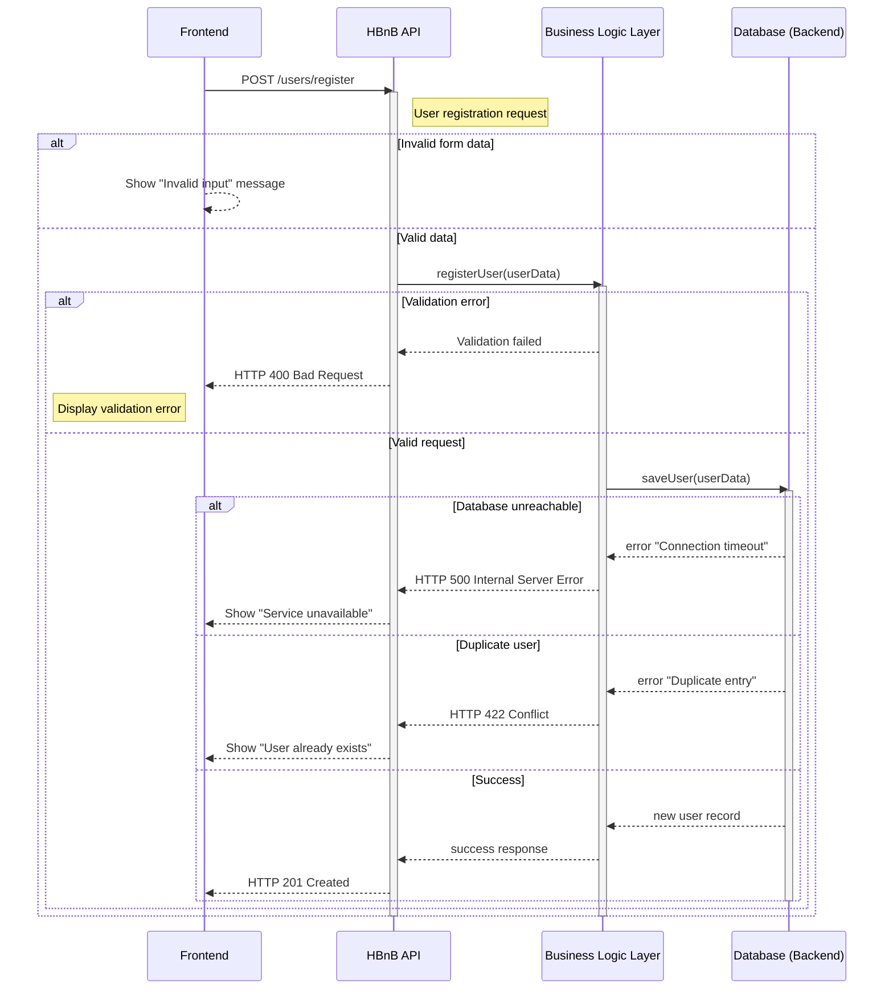
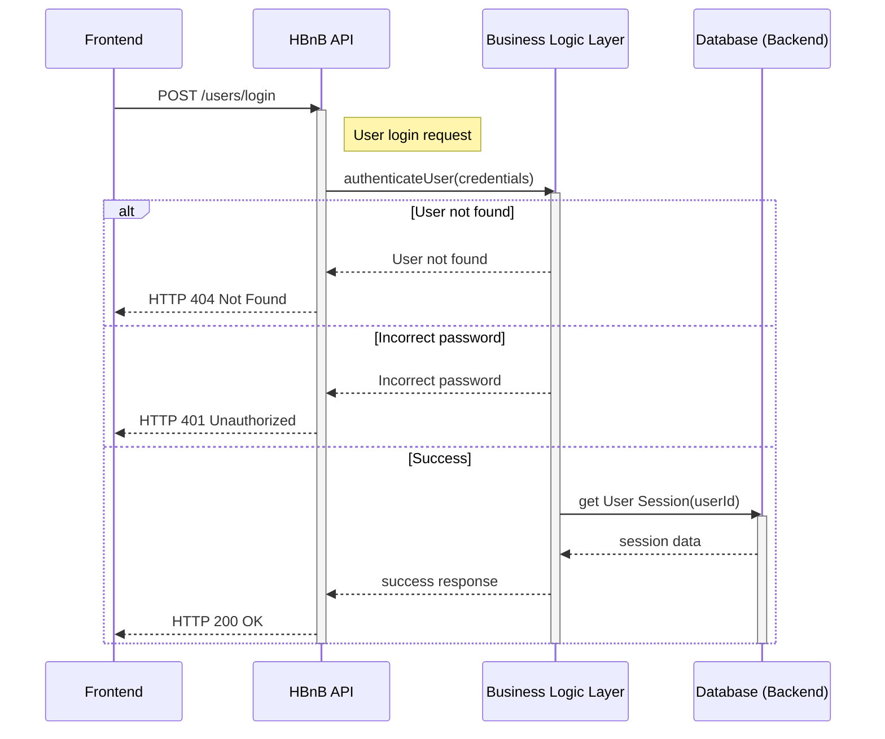
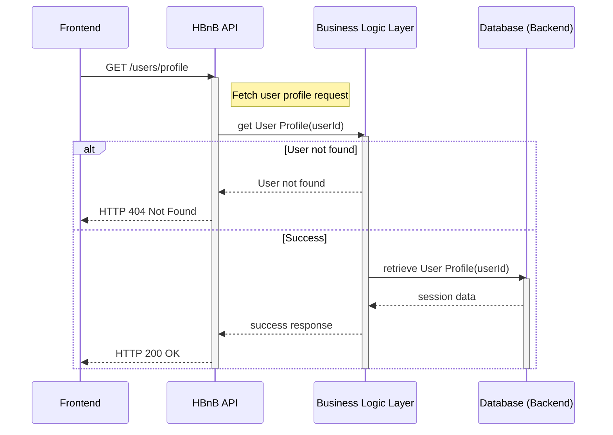
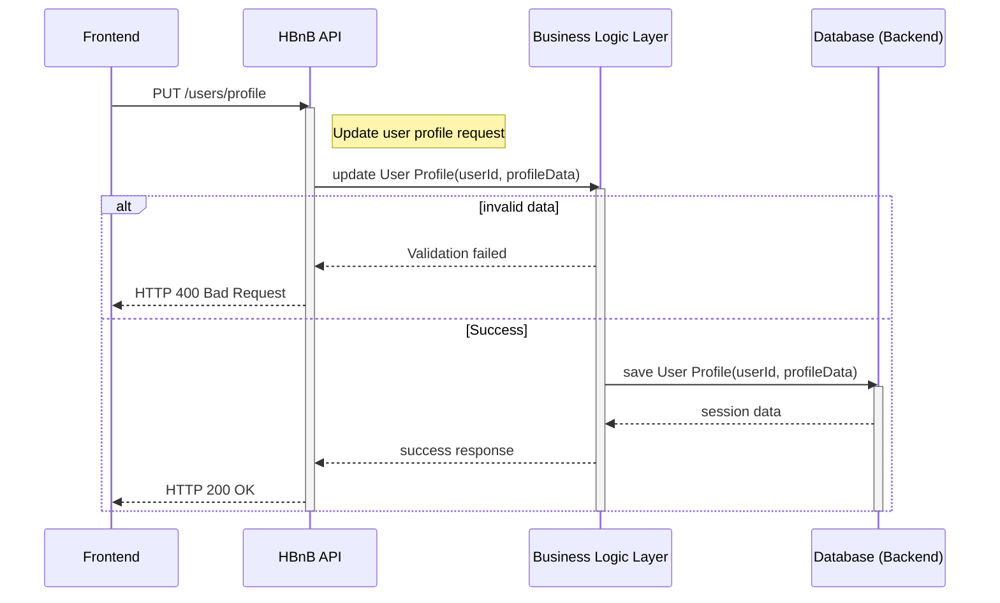

# task_0 High-Level Package Diagram
# note
1.Presentation Layer

Components:
UserService: Manages user-related operations such as registration, login, and profile management.
PlaceService: Handles operations related to places, including listing, creating, and updating place details.
APIEndpoint: The interface through which clients interact with the services, receiving requests and sending responses.

2.Responsibility: This layer is responsible for handling user interactions with the application, serving as the entry point for all client requests. It processes input from users and returns responses after interacting with the underlying business logic.
Business Logic Layer

Components:
User: Represents user entities and encapsulates user-related business logic.
Place: Represents place entities and contains logic related to place management.
Review: Handles the logic for user reviews associated with places.
Amenity: Represents amenities associated with places, managing their attributes and behaviors.
Responsibility: This layer contains the core logic of the application, processing data received from the presentation layer and applying business rules. It acts as an intermediary between the presentation and persistence layers, ensuring that business rules are enforced.
Persistence Layer

Components:
Database Access: Interfaces for performing CRUD (Create, Read, Update, Delete) operations on the database.
Repositories: Abstraction layers that encapsulate data access logic, providing methods for querying and manipulating data.
Responsibility: This layer is responsible for data storage and retrieval. It directly interacts with the database, ensuring that data is persisted and can be accessed efficiently.
Communication Pathways
Facade Pattern:
The communication between the Presentation Layer and the Business Logic Layer is facilitated by the Facade Pattern. This design pattern provides a simplified interface (the API) to the complex subsystems (business logic and persistence layers), allowing the presentation layer to interact with the business logic without needing to understand the details of the underlying implementations.
The APIEndpoint acts as a facade that exposes methods from the UserService and PlaceService, allowing clients to perform operations without directly interacting with the business logic or persistence layers.
Benefits of the Facade Pattern
Simplicity: The facade pattern simplifies the interface for clients, making it easier to use the application without needing to understand the complexities of the underlying layers.
Decoupling: It decouples the presentation layer from the business logic and persistence layers, promoting a cleaner architecture and making it easier to maintain and extend the application.
Flexibility: Changes in the business logic or persistence layers can be made with minimal impact on the presentation layer, as the facade provides a stable interface.

# code

# task_1 Detailed Class Diagram for Business Logic Layer

# note

# code

# task_2 Sequence Diagrams for API Calls

# note

# code
# 1 - User Registration

# 2 - Place Creation

# 3 - Review Submission

# 4 - Fetching a List of Places

