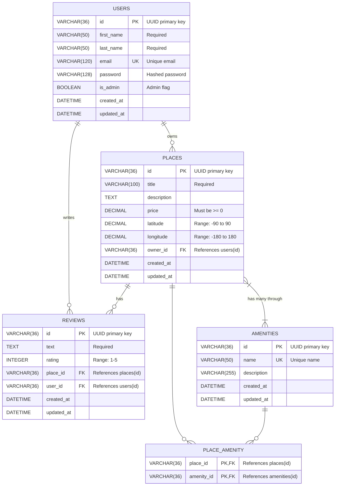

# HBnB Entity-Relationship Diagram

This document contains the ER diagram for the HBnB database schema using Mermaid.js notation.

## Database Schema

## Relationship Descriptions

| Relationship | Type | Description |
|--------------|------|-------------|
| `USERS → PLACES` | One-to-Many | A user can own multiple places |
| `USERS → REVIEWS` | One-to-Many | A user can write multiple reviews |
| `PLACES → REVIEWS` | One-to-Many | A place can have multiple reviews |
| `PLACES ↔ AMENITIES` | Many-to-Many | Places can have multiple amenities, amenities can belong to multiple places |

## Constraints

### Users Table
- `id`: Primary key (UUID)
- `email`: Unique constraint
- `is_admin`: Default FALSE

### Places Table
- `id`: Primary key (UUID)
- `price`: CHECK constraint (>= 0)
- `latitude`: CHECK constraint (-90 to 90)
- `longitude`: CHECK constraint (-180 to 180)
- `owner_id`: Foreign key to users(id) with CASCADE delete

### Reviews Table
- `id`: Primary key (UUID)
- `rating`: CHECK constraint (1 to 5)
- `place_id`: Foreign key to places(id) with CASCADE delete
- `user_id`: Foreign key to users(id) with CASCADE delete
- `(user_id, place_id)`: Unique constraint (one review per user per place)

### Amenities Table
- `id`: Primary key (UUID)
- `name`: Unique constraint

### Place_Amenity Table (Junction)
- `(place_id, amenity_id)`: Composite primary key
- `place_id`: Foreign key to places(id) with CASCADE delete
- `amenity_id`: Foreign key to amenities(id) with CASCADE delete
