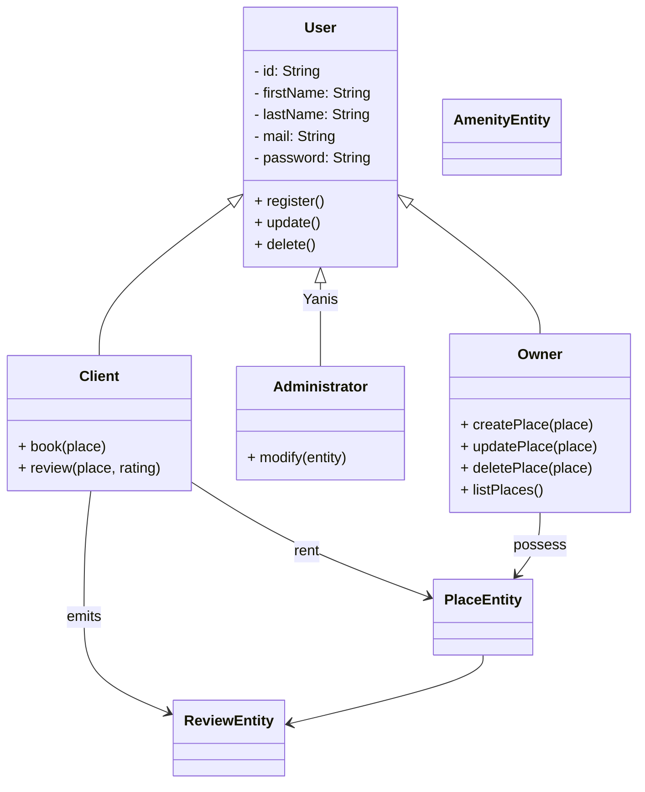

```mermaid
classDiagram
    direction TD

    User <|-- Client
    User <|-- Administrator : Yanis
    User <|-- Owner

    class User{
        - id: String
        - firstName: String
        - lastName: String
        - mail: String
        - password: String
        + register()
        + update()
        + delete()
    }

    class Administrator{
        + modify(entity)
    }

    class Client{
        + book(place)
        + review(place, rating)
    }

    class Owner{
        + createPlace(place)
        + updatePlace(place)
        + deletePlace(place)
        + listPlaces()
    }

    Client --> PlaceEntity : rent
    Client --> ReviewEntity : emits
    Owner --> PlaceEntity : possess
    PlaceEntity --> ReviewEntity

    class AmenityEntity{
    }
    class ReviewEntity{
    }
    class PlaceEntity{
    }
```
